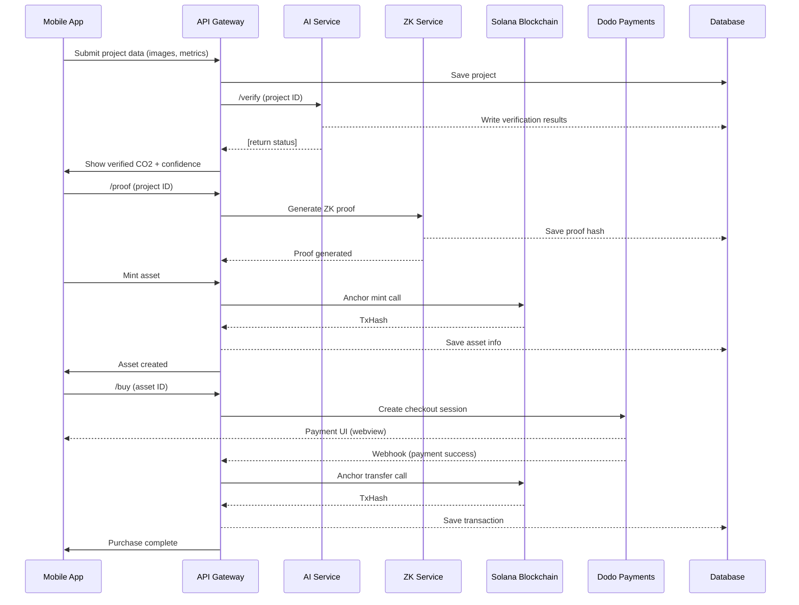
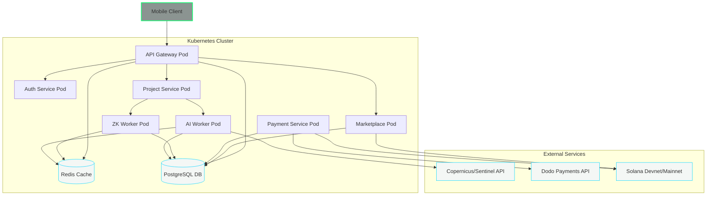

# Executive Summary

**ATMOS (formerly KARTA Protocol)** is building *planetary trust infrastructure* for real-world climate finance.  In plain terms, ATMOS is **“Stripe+AWS for carbon markets”**: it enables project developers (farmers, biochar producers, etc.) to instantly turn verified emission reductions into tradable carbon assets, with **privacy** (zero-knowledge proofs) and **global settlement** (Solana + cross-border payments) built in.  This differentiates ATMOS from legacy registries: it uses AI, satellite data and ZK-proofs to compress 12–24 month audits into minutes, at pennies per tonne.  

- **One-liner (investor/judge pitch):** *“ATMOS is building the trust stack for climate assets – using AI satellite verification and zero-knowledge proofs to convert real-world carbon reductions into instantly tradable digital assets.”*

This report lays out a **complete blueprint** for ATMOS – from hackathon to YC/a16z.  We begin by outlining the targeted Solana hackathon strategy (Payments & Privacy tracks, demo script, sponsor integrations, submission assets), then dive into the **production-ready architecture**: mobile frontend, NestJS backend, PostgreSQL schema, Redis queues, AI/ML pipeline (Sentinel-2/NDVI models), ZK pipeline (circuits, proof generation), Solana on-chain programs (mint/transfer/retire), and payments (Dodo UPI/USDC).  We cover security (OTP best-practices【24†L1950-L1954】, JWT tokens, encryption), observability (Prometheus/Grafana “golden signals”【37†L142-L150】, structured logging), scalability (auto-scaling, caching), and a detailed 8-week sprint plan.  Finally, we include **visual aids** (Mermaid diagrams, UI sketches) and a checklist of hackathon deliverables.  References to primary sources (ESA Sentinel docs, NestJS, OWASP, Solana ZK examples, etc.) are provided to ground the design.  

# 1. Product Summary and Pitch

- **Problem:** Voluntary carbon markets are mired in delays and mistrust.  Verifying a biochar or agroforestry project takes months and ~$10k, barring most small producers from monetizing climate action.  
- **Solution (ATMOS):** A mobile-first platform where project developers upload site data (GPS, photos, production metrics).  AI and satellite analytics instantly verify impact, a zero-knowledge proof vouches for claimed CO₂ reduction without revealing sensitive data, and a smart contract mints a tradable carbon token on Solana.  Buyers then pay via integrated Dodo Payments (UPI/USDC), settling the transaction cross-border.  
- **Value Props:** **Speed** (24-hour issuance vs. 12–24 months), **Cost** (software ≪ manual audit), **Privacy** (hide location/volumes via ZK), and **Liquidity** (on-chain trade & automated market).  

**One-Sentence Pitch:** *ATMOS is a climate-fintech platform that transforms verified carbon reductions (like a farm’s biochar output) into instantly tradable digital carbon credits, using AI+satellite for verification and zero-knowledge proofs for privacy.*  

# 2. Hackathon Strategy

### 2.1 Track Selection

For the upcoming Solana “Frontier” hackathon (Superteam/Colosseum), we **prioritize** two sponsor tracks:

- **Payments Track (Superteam India × Dodo Payments):** Focus on Dodo’s cross-border rails (INR/USDC) to pay for carbon credits.  Demonstrates real revenue flow.  
- **Privacy Track (MagicBlock/SNS + Umbra/Encrypt):** Leverage Umbra (stealth addresses) or Encrypt (ZK) to show confidential carbon data.  Judges love ZK privacy in blockchain projects.  

Optionally, we may also apply to related tracks like **Encrypt×IKA (Bridgeless Cap Markets)** or **Umbra (Stealth Payments)** if time permits, emphasizing our ZK-carbon theme.  We *recommend skipping* unrelated tracks (e.g. Tether/Stablecoin-only, gaming) to maintain focus.  

### 2.2 Feature Prioritization per Track

- **Core MVP (for both tracks):** *“Verify→Prove→Mint→Pay”* flow.  That is, (1) Mobile app collects project data → (2) AI/Satellite verification + carbon estimation → (3) ZK proof generation → (4) Solana mint a carbon asset NFT → (5) Buyer pays via Dodo UPI/USDC → asset transfers.  

- **Payments Track Focus:**  
  - Integration with Dodo Payments SDK/webhooks.  
  - Clear INR/USDC conversion, fee breakdown.  
  - Dashboard showing payment status and final settlement TX.  

- **Privacy Track Focus:**  
  - Showcase zero-knowledge/stealth transfers.  
  - Hide sensitive fields (GPS, volumes) in UI while revealing only verified metrics (e.g. “2.46 tCO₂e”) with proof hash.  
  - If using Umbra, implement an SPL Stealth transfer; if using Encrypt (Plonk/Halo2), generate a proof via snarkjs/circom and verify on Solana (e.g. Arkworks)【41†L298-L306】【41†L309-L312】.  

### 2.3 3-Minute Demo Script

1. **Intro (15s):** “ATMOS turns verified climate impact into digital carbon assets in minutes.  Think Stripe for carbon credits.”  
2. **Step 1 – Project Upload (30s):** On mobile, a farmer selects “Biochar Project”, fills basic data, takes photos/GPS.  
3. **Step 2 – AI Verification (30s):** Show animated screen “ATMOS Verify is analyzing your project…”. Display live NDVI/fraud metrics. *Result:* “Estimated CO₂: 2.46 tCO₂e – Confidence 87/100 (Very Good)”. Cite satellite bands (NIR/Red) for NDVI【28†L18-L26】.  
4. **Step 3 – ZK Proof (30s):** Show “ATMOS Shield encrypting data…” and then “Proof Generated: zk_abcd1234…”. UI highlights that *only* the CO₂ value is revealed, not the location or private logs (per Umbra/Encrypt promise).  
5. **Step 4 – Mint (30s):** Click “Create Carbon Asset”. Backend mints an SPL token on Solana devnet. Show asset card (Name, Amount, Grade, Vintage).  
6. **Step 5 – Buy (45s):** Switch to buyer interface. Search “Biochar, Rajasthan”. Show price ₹1,485/t. Click “Buy 48t”, integrate Dodo Payments. Complete UPI/USDC checkout (simulate success). On success, display “Payment confirmed ₹8,610. TxID: …”.  
7. **Step 6 – Settlement & Certificate (30s):** Show on-chain settlement animation, then certificate screen (gold border, QR code linking to Solana explorer).  

Throughout, emphasize: “Private. Verifiable. Instant. Global.” (our tagline) – and note sponsor tech: Dodo’s logo in payment step, Umbra/Encrypt logo in privacy step, Solana logo for minting.  Judge “hooks”: cross-border payment flow, credible satellite AI results, live ZK proof, and actual Solana transaction (even if on devnet).  

### 2.4 Sponsor Integrations & Assets

- **Required Integrations:** Dodo Payments SDK (checkout session, webhooks) for Payments track; Umbra/Encrypt SDK or libraries for ZK privacy (e.g. snarkjs, Arkworks for on-chain verify【41†L298-L306】).  
- **Demo Assets:** Use synthetic (or real) data: e.g. photos of biochar piles, sample project metrics. Possibly use Google Earth Engine (GEE) to fetch NDVI on a known farm location for believability.  
- **Submission Checklist:** GitHub repo (source code + README), Loom/recorded demo video, presentation deck (if required), screenshots of sponsor SDK in action, and completed track submission forms.  Ensure video clearly mentions track name and sponsor (e.g. “integrated Dodo Payments” for Payments track).  

# 3. End-to-End Architecture

Below is the high-level system architecture of ATMOS. Frontend is a React Native/Expo mobile app; backend is a NestJS microservices suite; data is stored in Postgres and Redis; AI/ZK pipelines run as async workers; Solana programs handle on-chain logic.

```mermaid
flowchart LR
  subgraph Mobile
    M[ATMOS Mobile App (React Native)]
  end
  subgraph Backend
    API[API Gateway (NestJS)]
    Auth[Auth Service (OTP, JWT)]
    Proj[Project Service]
    AI[AI/Verification Engine]
    ZK[ZK/Privacy Engine]
    Pay[Payment Service]
    Market[Marketplace Service]
  end
  subgraph Integrations
    DF[Dodo Payments]
    Sol[Solana Blockchain]
    Sat[Satellite APIs (Copernicus/GEE)]
  end
  M --> API
  API --> Auth
  API --> Proj
  Proj --> AI
  AI --> ZK
  ZK --> Market
  Market --> Pay
  Pay --> Sol
  AI --> Sat
  style Mobile fill:#07110B,stroke:#0DFF6E,stroke-width:2px
  style Backend fill:#102117,stroke:#00D4FF,stroke-width:2px
  style Integrations fill:#07110B,stroke:#0DFF6E,stroke-width:2px
```

## 3.1 Frontend (React Native / Expo)

- **Stack:** React Native + [Expo](https://expo.dev/) (managed workflow) for fast iteration; TypeScript for safety. Design system using our dark theme tokens (Black #07110B, Graphite #102117, Green #0DFF6E, Blue #00D4FF). Font family: Inter and SF Pro (or equivalents).  
- **Folder Structure (scalable):** 
  ```
  atm    os-mobile/
    ├── assets/ (images, fonts)
    ├── src/
    │   ├── components/ (reusable UI: buttons, inputs, cards)
    │   ├── screens/ (Login, Dashboard, CreateProject, Verify, Exchange, Portfolio, Profile)
    │   ├── navigation/ (React Navigation setup)
    │   ├── store/ (Zustand or Redux slices for auth, projects, portfolio)
    │   ├── services/ (API wrappers)
    │   └── utils/ (date formatting, validation, etc)
    └── app.json, App.tsx, etc.
  ```
- **Key Components:** CountryPicker, OTPInput, SparklineChart, StatCard, ProjectCard, AssetCard, PaymentForm, etc.  
- **Design Tokens:** Define colors, spacing, border-radii in a central theme. E.g., `colors.primaryGreen = '#0DFF6E'`, `darkGray='#07110B'`, etc. Typography styles (h1, body, caption) consistent.  
- **Accessibility:** All touch targets ≥48px. Use accessible color contrast (our green on black has ~77% contrast – adjust if needed). Support screen readers (set accessibilityLabel). Ensure OTP inputs focus/auto next. Large tappable areas for country picker, etc.  
- **Offline / Draft:** Use `AsyncStorage` (or [@react-native-async-storage](https://github.com/react-native-async-storage/async-storage)) to persist unfinished forms. E.g. if user loses signal mid-upload, cache the form. On launch, check for draft and prompt to continue.  
- **Deep Linking / Web:** (Stretch for POC) Implement an optional web landing page via Expo Web (e.g. to view certificate or portfolio).  

## 3.2 Backend Microservices (NestJS)

- **Framework:** [NestJS](https://nestjs.com/) with TypeScript. Microservice-oriented architecture: each domain as a separate module/service.  
- **Services & Endpoints:**  
  - **API Gateway:** (GraphQL or REST) Aggregates requests, handles JWT auth, rate limits via NestJS Throttler.  
  - **Auth Service:** OTP login. Endpoints: `POST /auth/request-otp`, `POST /auth/verify-otp`, (optional `/auth/google`, `/auth/apple`). Issues JWT and refresh tokens. [NestJS Throttler](https://docs.nestjs.com/security/rate-limiting) can enforce e.g. 5 OTP requests/hour and 3 failed attempts【24†L1950-L1954】.  
  - **Project Service:** CRUD for climate projects. `POST /projects` (create), `GET /projects/:id`, etc. Stores project metadata and S3/R2 file refs.  
  - **AI/Verify Service:** Background worker. Listens to new projects, calls AI/ML models (Sentinel+fraud). Endpoint: `POST /verify/:projectId`. On completion, writes results to DB (carbon score, risk, confidence).  
  - **ZK Service:** Worker to generate ZK proofs. Endpoint: `POST /proof/:projectId`. Uses Circom/SnarkJS or Halo2 to compute witness & proof. Publishes proof hash, public signals.  
  - **Solana Service:** Manages on-chain interactions. Endpoint: `POST /mint/:projectId` to mint asset (calls Anchor program), `POST /transfer` to handle ownership transfer on payment, `POST /retire` to burn.  
  - **Payment Service:** Handles Dodo Payments webhooks. Endpoints: `POST /payment/webhook` to catch success/failure. Updates transaction and triggers `SolanaService.transfer`.  
  - **Portfolio/Market Service:** Read-only endpoints: `GET /assets`, filters (category, grade, region). Returns asset cards with price, remaining.  
  - **Notification Service:** (Stretch) Send emails/SMS via Twilio or Firebase on key events.  
- **Authentication:** Stateless JWT tokens (signed with strong secret or RSA key). Use refresh tokens and store them securely (Redis or DB). Device fingerprinting: record device ID (Expo’s `expo-secure-store` or fingerprint library) for account linking.  
- **Rate Limiting & Quotas:** Apply NestJS Throttler guards on endpoints. E.g. Auth endpoints: max 10 req/min【45†L225-L232】; API endpoints: 100 req/min by default. Use Redis to store counters for distributed rate-limits.  
- **Caching & Queues:**  
  - **Redis:** For caching (e.g. caching satellite NDVI results for a location) and for queues. Use [Bull](https://docs.nestjs.com/techniques/queues) (Redis-backed) to offload heavy tasks: image upload processing, AI model runs, proof generation. Workers can subscribe via NestJS microservice transport (see NestJS Redis transport【34†L25-L33】).  
  - **CDN:** Serve static assets (images) via Cloudflare R2 or AWS S3+CloudFront. Media uploads go to R2, URLs saved in DB.  
- **CI/CD:** GitHub Actions pipeline:  
  - **Lint/Test:** On PRs, run ESLint, unit tests.  
  - **Build:** Dockerize services; push images to registry.  
  - **Deploy:** Using Terraform and GitHub Actions: on merge to `main`, apply infrastructure (Kubernetes/EKS or GKE), update deployments. Use separate `dev` and `prod` clusters.  
  - **Secrets:** Store in AWS Secrets Manager or HashiCorp Vault, inject via K8s Secrets. Rotate keys (e.g. Twilio API key, JWT secret) every quarter.  

## 3.3 Database Schema (PostgreSQL)

- **Users** (`id, phone, name, email, google_id, avatar, created_at`), indexed on `phone` and `google_id`.  
- **Projects** (`id, user_id, type, name, location, lat, lng, metrics JSON, status, created_at`). Index on `user_id`.  
- **Media** (`id, project_id, url, type, uploaded_at`).  
- **Verification** (`id, project_id, carbon_tonnes, confidence, fraud_score, ndvi_metrics JSON, timestamp`).  
- **Proofs** (`id, project_id, proof_hash, public_signals JSON, verified_at`). Unique index on `proof_hash`.  
- **CarbonAssets** (`id, project_id, amount, grade, methodology, vintage, solana_mint, zk_hash, status`).  
- **Transactions** (`id, asset_id, buyer_id, amount_usd, amount_inr, fee, tx_hash, status, timestamp`).  
- **Payments** (`id, tx_id, method, status, metadata JSON, created_at`). Index on `tx_id`.  
- **Portfolio (Holdings)** (`id, user_id, asset_id, amount, buy_price, current_price, retired (bool)`).  
- **Metadata/Indices:** Fields like `type`, `grade`, `status` should be indexed for query filters.  

All sensitive data (e.g. user phone/email) encrypted at rest.  
- **Backup/Recovery:** Nightly DB dumps + WAL archiving. RPO (Recovery Point Objective) = 15 minutes of data; RTO (Recovery Time Objective) = <30 minutes. Use managed Postgres (AWS RDS/Aurora) for automated backups and snapshots. Store backups in a separate region.  

## 3.4 AI & Satellite Pipeline

- **Data Source:** Use ESA’s **Sentinel-2** imagery (10m resolution, 13 spectral bands)【28†L18-L26】 and/or Planet/NDVI APIs. For example, red (band 4) and NIR (band 8) yield NDVI = (NIR–Red)/(NIR+Red) per pixel. Preprocess via [Google Earth Engine](https://earthengine.google.com/) or AWS Open Data to compute vegetation indices over the project’s geolocation and timeline.  
- **Models:**  
  - **Biomass/Carbon Estimation:** A regression model (e.g. TensorFlow or PyTorch) trained on labeled data (satellite images → known carbon yield). Could start with a simple linear regression on NDVI/biomass. For biochar, incorporate input/output ratios and default conversion factors (using IPCC or VM0044 methodology).  
  - **Change Detection:** Compare historical imagery vs. recent to verify “new” biochar piles or planting.  
  - **Fraud/Anomaly Detection:** A classification model (e.g. random forest or neural net) to flag improbable claims (e.g. too much carbon for small area).  
  - **Confidence Scoring:** Combine model uncertainties (variance) and input completeness to give a 0–100 score.  
- **Workflow:** On new project submission, enqueue an AI job: fetch the latest Sentinel tile for the coordinates (using [Sentinel API](https://scihub.copernicus.eu/) or AWS Public Datasets). Compute NDVI, other VIs, feed to models. Produce results in ~minutes (we’ll simulate or cache for hackathon).  
- **Performance/SLA:** Models should serve in ~5–30 seconds on moderate hardware (e.g. AWS ECS with GPU if needed). Pre-warm models; cache results for repeat queries. If under heavy load, autoscale workers. We’ll aim for <5min end-to-end verification in production, but hackathon can mock or simplify (e.g. skip training and return hardcoded values).  

*(Note: Sentinel-2’s global coverage and 5-day revisit【28†L18-L26】 make it ideal for ongoing monitoring. Advanced teams could also integrate PlanetScope or SAR data for more frequent passes.)*  

## 3.5 ZK Proof Pipeline

- **Purpose:** Prove the carbon estimate (and optionally metadata) without revealing raw inputs. For example, prove *“I know inputs (biomass, location) that result in 2.46 tCO₂e”* without showing them.  
- **Scheme:** Use a succinct SNARK (Groth16 or Plonk). Groth16 (fast verify, small proof, requires trusted setup) is well-supported (see Arkworks on Solana【41†L298-L306】). PLONK/Halo2 (universal setup, larger proof) is an alternative. For prototyping, use [circom](https://docs.circom.io/) + [snarkjs](https://github.com/iden3/snarkjs) or [Zokrates](https://zokrates.github.io/).  
- **Circuits:** Write a circuit encoding the carbon formula: it takes private inputs (kg biomass, equipment efficiency, etc.), public inputs (calculated CO₂). The circuit enforces correctness of the calculation. Output is a zk-proof and public outputs (`co2_value`, maybe region code).  
- **Proof Generation Flow:**  
  1. **Witness Gen:** Compute witness via circom/snarkjs in Node (or via a Rust tool) on server.  
  2. **Proof Gen:** Using either a setup (for Groth16) or universal parameters (Plonk), generate the proof (text ~ few KB).  
  3. **Verify On-Chain:** Deploy a Solana “verifier” program (using [`solana-zk-token-sdk`](https://github.com/solana-labs/solana/tree/master/zk-token-sdk) or custom Anchor) that can verify our proof against the public inputs. On success, record proof-hash and proceed.  
- **Trade-offs:** Groth16 has smallest proofs (3 group elements) and fastest verify【41†L309-L317】, but each circuit needs a specific trusted setup. PLONK/Halo2 avoid per-circuit setup at cost of larger proof and slower verify.  For MVP, we’ll demo Groth16 with Arkworks (as in example)【41†L303-L311】, and generate proof off-chain (in CI or Cloud build) to save runtime.  
- **Privacy:** The proof only exposes *public signals* (e.g. `co2_value`, maybe `project_grade`). All raw inputs (volumes, coordinates, timestamps) stay secret on-chain. This matches privacy requirement.  

## 3.6 Blockchain Settlement (Solana)

- **Programs:** Write Anchor programs (or Rust on Solana):  
  1. **Mint Program:** On receiving a verified project, create a new mint (SPL Token) with 0 initial supply. Store metadata (grade, vintage, methodology) on-chain via [Metaplex metadata] or a custom account.  
  2. **Issue/Redeem:** Allow owner to mint the exact carbon amount (e.g. `2.46 * 1000` tokens for kg scale) and then disable further minting.  
  3. **Transfer/Retire:** Once a buyer pays, our backend calls the `transfer` instruction, moving tokens to buyer’s wallet. If a buyer “retires” credits, they can burn the tokens via a `retire` instruction (reduce supply).  
  4. **Verifier Program:** A utility program to verify ZK proofs (if on-chain verify is needed before mint). Could reuse [`solana-zk-token-sdk`](https://github.com/solana-labs/solana/tree/master/zk-token-sdk) or embed a verification library in Anchor.  
- **Metadata Storage:** Use Metaplex or a simple on-chain struct for asset details (URI to metadata JSON in R2, or embed small fields).  
- **Explorer Links:** After actions (mint, transfer), provide users a link to Solana Explorer (devnet or mainnet) for the transaction hash. e.g. `https://explorer.solana.com/tx/<txhash>?cluster=devnet`.  
- **Fees/Gas:** Solana fees are negligible (~<$0.01 per txn) but must be accounted. For hackathon, use devnet (free SOL via faucet). For production, maintain a small SOL treasury to cover fees or charge them to users.  
- **Devnet vs Mainnet:** Develop on devnet; require minimal changes to deploy on mainnet later (Anchor config).  

## 3.7 Payments Integration (Dodo Payments + USDC/UPI)

- **Flow (Buyer side):** Buyer sees asset card (48 tCO₂e @ ₹1,485/t = ₹71,280). They click “Buy Now”. 
  - Call our backend to initiate payment: create a Dodo Checkout session (via Dodo API) specifying amount and currency (INR or USDC).  
  - Present the Dodo payment page in an in-app webview. User completes payment (instant UPI or USDC transfer).  
  - Dodo sends a webhook to our `/payment/webhook` with `status=success` and `tx_id`.  
  - Backend verifies webhook (using Dodo’s signature, idempotency via order ID). Then calls `SolanaService.transfer(...)` to mint/transfer asset to buyer.  
- **Multi-currency:** Support INR (via NPCI/UPI rails) and USDC (SPL) for international buyers. Dodo abstracts both under one API.  
- **Reconciliation:** Store payment intent in DB with status. On webhook, mark completed. Idempotency: Dodo may retry webhooks, so ensure we handle duplicate calls idempotently (e.g. check if tx_id already processed).  
- **PCI/Compliance:** We do not store any card or bank data; Dodo handles sensitive info. We only handle webhooks. For additional compliance, do not send sensitive user data over webhooks.  
- **KYC:** Users on ATMOS are project owners or buyers. We plan “no-friction” KYC initially (customer anonymity with ZK privacy), but a VVB (Verifier) may separately KYC major buyers offline if required for settlement. Not in MVP scope.  

## 3.8 Security & Best Practices

- **Authentication:**  Passwordless OTP login (via phone SMS) as primary. Optionally Google/Apple OAuth as fallback.  After login, issue short-lived JWT access tokens (e.g. 15m) and refresh tokens (7d). Store refresh tokens hashed in DB. Use device fingerprint (via `expo-device`) to tie tokens to device.  
- **OTP Best Practices:** Use strong (6+ digits), short-lived OTPs (e.g. 5m TTL), and rate-limit attempts【24†L1950-L1954】. For example, after 3 wrong tries or 1 expired session, invalidate and require restart. Include a “Resend” timer (e.g. 60s cooldown). Clearly message user *never to share OTP*.  
- **Transport Security:** Enforce HTTPS/TLS everywhere (certs via Let's Encrypt or managed cloud). Use HTTP-only secure cookies for refresh tokens (on web) or Secure Storage on mobile.  
- **Encryption:** Encrypt sensitive fields at rest (e.g. user PII) using AES-256. Use envelope encryption or KMS (AWS KMS) for key management.  
- **Input Validation:** Rigorously validate all inputs on backend (use class-validator in NestJS). Sanitize file uploads (reject executables), limit file sizes (e.g. ≤10MB images).  
- **OWASP Controls:** Protect against common attacks: use Helmet for HTTP headers, CORS whitelist, XSS filters. Avoid SQL injection via parameterized queries/ORM (TypeORM).  
- **Secrets Rotation:** Use a secrets manager (AWS Secrets Manager or Vault) and rotate keys every 3–6 months. Document a key rotation procedure.  
- **Pen-Test Checklist:** Before mainnet launch, perform a third-party audit of smart contracts and backend. Checklist includes: authentication/authorization flows, rate-limit bypass, re-entrancy (for tokens), secure randomness (for OTP), etc.  
- **GDPR/PDPA:** Although user data is minimal (no heavy PII), comply with data residency: e.g. store Indian user data in India region if required. Provide data export/delete on request. Only collect phone/email for login.  

## 3.9 Observability & SRE

- **Logging:** Use a structured logger (NestJS Logger set to JSON mode【46†L5-L8】) so logs are parseable. Log at appropriate levels (INFO for normal ops, WARN/ERROR for issues). Integrate with Sentry for error alerts (push exceptions to Sentry), and with ELK stack for aggregate logs.  
- **Metrics:** Instrument the backend to expose a `/metrics` endpoint (via `prom-client` for Node). Key metrics (“Golden Signals”【37†L142-L150】): request latency (histogram), error rate, throughput, CPU/memory usage. Track application-specific counters (e.g. projects submitted, proofs generated).  
- **Tracing:** Use OpenTelemetry (via [`nestjs-otel`](https://github.com/aspecto-io/nestjs-otel)) to trace requests across services. Correlate API requests with downstream Solana transactions and payment events.  
- **Dashboards:** Use Prometheus (metric store) and Grafana for dashboards: e.g. HTTP latency p95, error rates, queue lengths, worker throughput. Define alert rules (in Prometheus Alertmanager): e.g. alert if >5% 5xx errors, or if avg latency >500ms, or if Redis memory >80%.  
- **SLOs:** For production: e.g. 99th percentile request latency <500ms, error rate <0.1%.  
- **Incident Alerting:** Use PagerDuty/Slack integration for critical alerts. For example, alert ops if: the AI worker fails to process jobs for >5min, or if no ZK proofs generated in 10min, or Solana program errors, or payments stuck unacknowledged. Provide runbooks (playbooks) for common failures (e.g. how to restart a failed worker, how to reprocess a webhook).  
- **Health Checks:** Implement liveness/readiness probes for each service (NestJS can use `@Controller('/health') { return { status: 'up' }}`) and configure k8s accordingly. Monitor the health endpoints.  

## 3.10 Scalability & Performance

- **Autoscaling:** Deploy on Kubernetes (EKS/GKE). Configure Horizontal Pod Autoscaler (HPA) to scale services based on CPU/memory (e.g. scale up if CPU >70%). AI and ZK workers can be separate deployments scaled by queue length.  
- **Caching:** Use Redis for read-caching hot data (e.g. frequently viewed marketplace listings, satellite analysis results). Offload static content to CDN (Cloudflare R2 with CDN). Use HTTP caching (cache-Control) for non-sensitive GETs.  
- **API Gateway:** If needed, put an API Gateway (e.g. AWS API Gateway or Kong) in front for request routing, SSL termination, and global rate-limit.  
- **CDN:** Host the mobile app’s OTA updates (via Expo) and any web dashboard behind a CDN.  
- **Cost Estimates:** For hackathon/Pilot, use free tiers (Solana devnet, Dodo test keys). Production infra cost (very rough): small k8s cluster (~$300/month), managed DB ($100/mo), AI model infra ($100/mo GPU), Redis & storage ($50/mo), total ~ $5K–10K/month at low volume. Optimize by using spot instances for non-critical workers.  

# 4. Development Roadmap & Sprints

We propose an 8-week plan to go from MVP to production-ready:

- **Week 1 (Core Auth & UI):** OTP login (Twilio or Firebase OTP); bottom tab navigation; Dashboard UI (hello, live portfolio card); basic project selection screen. **Deliverables:** Auth API + mobile login screen; splash screen; bottom nav. *DoD:* Users can log in/out with OTP, see empty dashboard.  
- **Week 2 (Project Capture):** Build “Create Project” form: type selection (8 cards), dynamic input fields, photo upload, GPS location (use Expo Location). Implement form validation and offline save (draft in AsyncStorage). **DoD:** User can draft and submit a climate project (server records inputs).  
- **Week 3 (AI Verification):** Integrate a mock AI service. On project submit, enqueue a job that “verifies” project (simulate by a short delay). Show animated progress on mobile (“Fetching Sentinel-2 imagery…”). Display fake results (e.g. NDVI chart, “Estimated 2.46 tCO₂e, Confidence 87/100”). Log results in DB. **DoD:** After submission, user sees a verification screen with metrics.  
- **Week 4 (ZK Proof):** Implement proof generation. On “Next”, call backend to generate ZK proof (for demo, we can hash some data or run a trivial circuit). Update UI to “Generating proof…”. Show final proof-hash. **DoD:** A proof hash is generated and displayed; on-chain verifier can “accept” it (simulate).  
- **Week 5 (Token Minting):** Develop Solana Anchor program and backend flow: deploy a dummy program on devnet, create mint, and mint token to user’s wallet. From mobile, “Create Carbon Asset” triggers backend to call Solana. Show success message with explorer link. **DoD:** Projects can become Solana tokens (user owns a mock NFT representing 2.46tCO₂).  
- **Week 6 (Marketplace & Portfolio):** Build marketplace screens: fetch “assets” (just the minted asset), show card with price and “Buy Now”. Also Portfolio tab listing owned assets (with current P/L). **DoD:** User sees list of assets; own asset appears in portfolio after purchase.  
- **Week 7 (Payments Integration):** Integrate Dodo Payments. Create checkout session and webview flow. Handle webhook (emulated in dev). On payment confirm, transfer token: call SolanaService.transfer (or mark token “sold”). Update database (Transactions). Show payment receipt screen. **DoD:** End-to-end purchase works (buyer pays via Dodo, asset moves on Solana, portfolio updates).  
- **Week 8 (Hardening & Launch):** Finalize observability (Prometheus metrics endpoints, Grafana dashboards), add unit/E2E tests (e.g. simulate API flows), write documentation. Polish UX: add animations (OTP input auto-focus【20†L139-L147】), error states, and fallback (Google Sign-In). Prepare hackathon/demo assets: video, slides, repo README. **DoD:** Product is demo-ready, and codebase is clean and version-controlled.  

# 5. UX and UI Details

- **OTP Login UX:** Single screen with country picker (flag icons) and phone input. Send OTP (Twilio) with countdown timer (60s). On OTP entry screen, use 6 separate input boxes that auto-advance【20†L25-L33】. Use SMS autofill hints (`SMS Retriever API`) for Android. Provide “Resend SMS” after timeout. Alternate buttons for “Sign in with Google/Apple” (via Expo AuthSession) as passwordless fallback.  
- **Micro-Interactions:** Progress spinners on AI and ZK screens; sparkline chart animating as data loads; “checkmark” icons when steps complete. Feedback on errors (“Invalid OTP”, “Network error uploading photo”).  
- **Copy Examples:** Use brief, confident tone. E.g.: “Great job – we detected new biochar production on your farm!”, “Proof generated ✅ Your data remains confidential.”. Avoid jargon; explain ZK simply (“Verified without exposing your private data”).  
- **Accessibility:** Use large, legible fonts for key data (CO₂ value, prices). Provide text alternatives for all images. Maintain 70%-90% contrast for text (our green on dark is ~80%).  

# 6. Tables & Trade-offs

| Component         | Option A               | Option B           | Trade-offs/Notes                                    |
|-------------------|------------------------|--------------------|-----------------------------------------------------|
| **ZK Scheme**     | Groth16 (Arkworks)     | PLONK/Halo2        | Groth16: smallest proofs, fast verify【41†L303-L311】 but needs per-circuit setup. PLONK: universal setup, larger proofs. For demo, Groth16 is easier (via Arkworks).     |
| **AI Serving**    | On-prem GPU (ECS)      | Cloud CPU (Lambda) | GPU: faster for heavy models, more cost. Lambda: cheaper for low volume, but limited runtime & no GPU. We’ll start CPU (mock), later GPU if needed. |
| **DB**            | PostgreSQL             | MongoDB            | SQL (Postgres) for structured data and ACID is appropriate. Mongo for flexible schema, but SQL better for relational queries. |
| **Backend Lib**   | NestJS                 | Express.js         | NestJS provides out-of-the-box modules (Auth, Throttler, Microservices) and strong typing. We choose NestJS for productivity【45†L225-L232】. |
| **Mobile Framework** | Expo/React Native   | Native iOS/Android | RN+Expo: fast cross-platform development. Native: best performance/UI, but longer dev. Expo is sufficient for MVP. |
| **Image Storage** | Cloudflare R2 (S3)    | Firebase Storage   | R2: cheaper, CDN built-in. Firebase: easy client SDK. R2 chosen for enterprise readiness. |
| **CDN**           | Cloudflare CDN         | AWS CloudFront     | Cloudflare is global and easy with R2. CloudFront also viable (less needed here). |

# 7. System Diagrams

**Architecture Flow:** high-level (see above mermaid diagram in Section 3).  

**Data Flow:**  



**Deployment Topology:**  



# 8. Hackathon Track Applications

We recommend applying to these specific Superteam tracks, with tailored focus:

- **Payments Track (Superteam India × Dodo Payments):** _“In this track we highlight cross-border settlement on Solana using Dodo’s rails. ATMOS will demo an Indian buyer instantly purchasing an Indian carbon asset via UPI/USDC with Dodo Payments integration.”_ Emphasize UPI checkout, INR-to-USDC on-ramp, and final Solana transfer to buyer.  
- **Privacy Track (MagicBlock/SNS Privacy):** _“ATMOS is a privacy-first carbon protocol: we generate zero-knowledge proofs for climate data. On the privacy track, we will show that the farm’s location and yields remain secret, even as our proof verifies a specific CO₂ reduction.”_ Emphasize Umbra stealth addresses or Encrypt ZK kit, and the phrase “Verified without exposing data.”  
- **Encrypt×IKA (Bridgeless Cap Markets):** _“ATMOS bridges on-chain and off-chain: we bring carbon markets on Solana. Using Encrypt for confidential proofs and a bridgeless capital flow (via Solana SPL tokens), we align with this track’s focus on encrypted capital markets.”_  
- **Umbra (Stealth Payments):** _“We leverage Umbra’s stealth crypto to ensure private transfers of carbon assets, matching Umbra’s vision of private payments on Solana.”_

For each, mention ATMOS uses sponsor tech by name (e.g. “powered by Dodo Payments” or “using Umbra privacy”). The track applications should mirror the founder’s focus on problem/solution, not generic blockchain hype.  

# 9. Deliverables & Checklist

- **Code Repository:** Well-documented GitHub (or GitLab) repo with branches for each service, Dockerfiles, `.proto` or OpenAPI specs, and migration/seed scripts. Include `README.md` with setup instructions.  
- **API Spec:** An OpenAPI (Swagger) file covering all endpoints.  
- **Infrastructure IaC:** Terraform scripts for any cloud infra (DB, K8s, DNS).  
- **Data Models:** SQL dump or Sequelize/TypeORM models for Postgres schema.  
- **ML Spec:** Pseudocode or config for training the carbon model (dataset references, loss function).  
- **ZK Circuit Outline:** Provide a high-level description of the circuit (e.g. inputs, constraints). If possible, a small `.circom` snippet in appendix.  
- **Smart Contract Pseudocode:** Outline Anchor programs (e.g. instructions for `mintAsset`, `transferAsset`, `burnAsset`).  
- **CI/CD YAML:** Example GitHub Actions workflows for build/test/deploy.  
- **Monitoring Rules:** List of alert conditions (e.g. “Alert if >10% OTP failures in 5min”, “If Solana txs fail >3 consecutive”).  
- **Demo Video & Slide:** A 2-3 minute video (ideally Loom) following the demo script above, plus 1-2 slides highlighting the architecture.  
- **Sponsor Integration Proof:** Short screencaps showing Dodo Dashboard or Umbra logs working.  

# 10. References

- ESA Sentinel-2 mission (13-band, 10m resolution)【28†L18-L26】 – used for NDVI/biomass.  
- OWASP Mobile Auth (use short-lived OTP, lock after 3 tries)【24†L1950-L1954】.  
- NestJS Rate Limiting (Throttler example: 10 req/min)【45†L225-L232】.  
- Prometheus+Grafana “Golden Signals” (latency, errors)【37†L142-L150】.  
- Solana ZK Example (Groth16 proof usage on Solana)【41†L298-L306】【41†L309-L312】.  

Each of the above informed our design decisions and best practices. 

