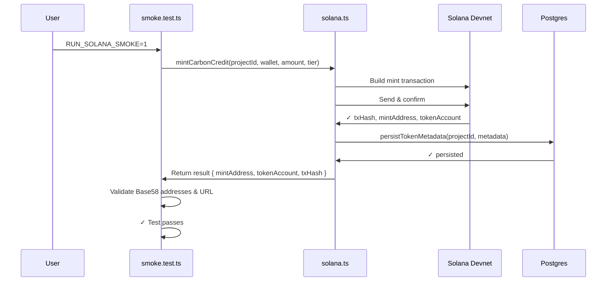

# Solana Devnet Smoke Test Runbook

**Updated:** May 28, 2026  
**Purpose:** Manual guide for running the Atmos carbon credit minting smoke test on Solana devnet

---

## Overview

The smoke test (`solana.smoke.test.ts`) validates the end-to-end Solana minting flow:
- Generates a random project ID
- Mints a carbon credit token on devnet
- Verifies mint address, token account, and transaction hash
- Returns an explorer URL for verification
- **Gated by default:** Only runs if `RUN_SOLANA_SMOKE=1` environment variable is set

**Test Location:** `app/api-server/test/solana.smoke.test.ts`  
**Package Script:** `pnpm --filter @workspace/api-server run test:smoke`

---

## Setup Requirements

### 1. **Solana Wallet Private Key**

You need a funded Solana devnet wallet.

#### Option A: Generate a New Devnet Wallet

```bash
# Install Solana CLI (if not already installed)
# macOS/Linux:
sh -c "$(curl -sSfL https://release.solana.com/v1.18.0/install)"

# Windows: Download from https://github.com/solana-labs/solana/releases

# Generate new keypair
solana-keygen new --outfile ~/solana-devnet.json

# Set default cluster to devnet
solana config set --url https://api.devnet.solana.com

# Fund the wallet with devnet SOL
solana airdrop 5

# Verify balance
solana balance
```

#### Option B: Export Existing Private Key

```bash
# If you have an existing Solana wallet keypair
solana config get

# Export the private key (CAREFULLY!)
cat ~/.config/solana/id.json
# Copy the array of integers
```

**WARNING:** The private key will be **base64-encoded** when stored in GitHub Secrets. The smoke test will decode it automatically via `getPayer()`.

---

### 2. **GitHub Secrets Configuration** (Required for CI)

Navigate to **GitHub Repository Settings → Secrets and variables → Actions**

Add two new secrets:

| Secret Name | Value | Example |
|---|---|---|
| `SOLANA_RPC_URL` | Devnet RPC endpoint | `https://api.devnet.solana.com` |
| `SOLANA_WALLET_PRIVATE_KEY` | Base64-encoded keypair JSON | `[1, 2, 3, ..., 255]` (array format) |

**To encode the private key:**

```bash
# Extract from keypair JSON
cat ~/solana-devnet.json | base64

# Or in PowerShell
certutil -encode solana-devnet.json solana-devnet.b64
```

---

## Running Smoke Tests Locally

### Prerequisites

```bash
# Clone repo and install deps
cd c:\Users\sonis\earn\Atmos
pnpm install

# Verify Solana CLI is installed and configured
solana config get

# Check devnet balance
solana balance
```

### Local Execution

#### **Option 1: Run in Terminal**

```bash
# Navigate to repo root
cd c:\Users\sonis\earn\Atmos

# Set environment variables and run test
set RUN_SOLANA_SMOKE=1
set SOLANA_WALLET_PRIVATE_KEY=[1,2,3,...,255]
set SOLANA_RPC_URL=https://api.devnet.solana.com
set SOLANA_NETWORK=devnet
set SPL_TOKEN_DECIMALS=6

# Run via pnpm
pnpm --filter @workspace/api-server run test:smoke

# Or directly with vitest
cd app/api-server
pnpm vitest run test/solana.smoke.test.ts
```

#### **Option 2: Run in VS Code Terminal**

```powershell
# In VS Code integrated terminal (PowerShell)
$env:RUN_SOLANA_SMOKE = "1"
$env:SOLANA_WALLET_PRIVATE_KEY = "[1,2,3,...,255]"
$env:SOLANA_RPC_URL = "https://api.devnet.solana.com"
$env:SOLANA_NETWORK = "devnet"
$env:SPL_TOKEN_DECIMALS = "6"

pnpm --filter @workspace/api-server run test:smoke
```

#### **Option 3: Create a `.env.local` File** (Not Committed)

```bash
# app/api-server/.env.local
RUN_SOLANA_SMOKE=1
SOLANA_WALLET_PRIVATE_KEY=[1,2,3,...,255]
SOLANA_RPC_URL=https://api.devnet.solana.com
SOLANA_NETWORK=devnet
SPL_TOKEN_DECIMALS=6
```

Then run:

```bash
pnpm --filter @workspace/api-server run test:smoke
```

---

## Running Smoke Tests via GitHub Actions CI

### Manual Workflow Dispatch

1. Go to **GitHub → Actions**
2. Select the **CI** workflow
3. Click **Run workflow**
4. Choose branch: `main` (or `umbra`)
5. Click **Run workflow**

This triggers the `solana-smoke` job, which will:
- ✅ Check out code
- ✅ Set up Node.js and pnpm
- ✅ Install dependencies
- ✅ Run `test:smoke` with secrets injected

**Expected Output:**

```
Running Solana devnet smoke test

    ✓ mints a carbon token on devnet and returns a usable explorer URL (12s)

Test Files  1 passed (1)
     Tests  1 passed (1)
```

**Explorer URL Format:**

```
https://explorer.solana.com/tx/<TX_HASH>?cluster=devnet
```

---

## Test Flow Breakdown



---

## Environment Variables Explained

| Variable | Required | Default | Example |
|---|---|---|---|
| `RUN_SOLANA_SMOKE` | **YES** | (none) | `"1"` |
| `SOLANA_WALLET_PRIVATE_KEY` | **YES** | (none) | `[1,2,...,255]` |
| `SOLANA_RPC_URL` | No | `https://api.devnet.solana.com` | `https://api.devnet.solana.com` |
| `SOLANA_NETWORK` | No | `devnet` | `devnet` \| `testnet` \| `mainnet-beta` |
| `SPL_TOKEN_DECIMALS` | No | `6` | `6` |

---

## Troubleshooting

### Issue: `SOLANA_WALLET_PRIVATE_KEY is required`

**Cause:** Environment variable not set  
**Fix:** Ensure the private key is exported before running the test:

```bash
# Terminal
export SOLANA_WALLET_PRIVATE_KEY="[1,2,3,...,255]"

# Or inline
SOLANA_WALLET_PRIVATE_KEY="[1,2,3,...,255]" pnpm test:smoke
```

---

### Issue: `Cannot parse private key`

**Cause:** Private key format is incorrect  
**Fix:** Verify the format:

```bash
# Should be a JSON array of integers (0-255)
✅ Correct:   [1, 2, 3, 255]
❌ Wrong:     "1,2,3,255"
❌ Wrong:     "base64_encoded_string"
```

Extract correct format:

```bash
cat ~/.config/solana/id.json
# [1, 25, 187, 32, 44, ...]
```

---

### Issue: `Insufficient balance`

**Cause:** Devnet wallet has < 0.02 SOL  
**Fix:** Request airdrop:

```bash
solana airdrop 5 --url https://api.devnet.solana.com
```

---

### Issue: Test times out (120s limit)

**Cause:** Devnet RPC slow or transaction confirmation delayed  
**Fix:**
1. Increase timeout in test (modify `solana.smoke.test.ts` last parameter: `120000`)
2. Switch RPC endpoint:
   - Primary: `https://api.devnet.solana.com`
   - Secondary: `https://devnet.helius-rpc.com` (free tier available)

```bash
export SOLANA_RPC_URL="https://devnet.helius-rpc.com"
```

---

### Issue: Transaction rejected with `Program log: Error`

**Cause:** On-chain program validation failure  
**Fix:** Check Postgres connection and metadata persistence:

```bash
# Verify API server is running
curl http://localhost:3001/health

# Check mint instruction parameters in solana.ts
# Ensure SPL_TOKEN_DECIMALS matches mint
```

---

## Post-Test Verification

### 1. **View Transaction on Explorer**

```
https://explorer.solana.com/tx/<TX_HASH>?cluster=devnet
```

Expected fields:
- ✅ Status: "Success"
- ✅ Signature: Base58-encoded
- ✅ Mint address created
- ✅ Token account created

### 2. **Query Postgres for Persisted Metadata**

```sql
SELECT * FROM project_metadata 
WHERE project_id LIKE 'smoke-%' 
ORDER BY created_at DESC LIMIT 1;
```

Expected output:

```
project_id       | smoke-1715606400000
name             | Atmos Carbon Token
symbol           | CARBON
uri              | <IPFS_or_URL>
collection_mint  | <MINT_ADDRESS>
```

### 3. **Verify Token Account Balance**

```bash
solana spl-token balance <TOKEN_ACCOUNT> --url https://api.devnet.solana.com
```

Expected: `0.01` (or minted amount)

---

## CI Workflow Status

**Current Setup:**
- ✅ GitHub Actions workflow defined (`.github/workflows/ci.yml`)
- ✅ Manual dispatch enabled (`workflow_dispatch`)
- ✅ Secrets required: `SOLANA_RPC_URL`, `SOLANA_WALLET_PRIVATE_KEY`
- ✅ Test gated by `RUN_SOLANA_SMOKE=1`

**Next Steps:**
- [ ] Add secrets to GitHub repository
- [ ] Manually dispatch workflow once to verify setup
- [ ] Monitor first run for any issues

---

## Additional Resources

- [Solana Devnet Faucet](https://faucet.solana.com/)
- [Solana Explorer](https://explorer.solana.com/?cluster=devnet)
- [SPL Token CLI Docs](https://spl.solana.com/token)
- [Vitest Docs](https://vitest.dev/)

---

**Last Updated:** May 28, 2026  
**Maintained By:** GitHub Copilot + Atmos Team

